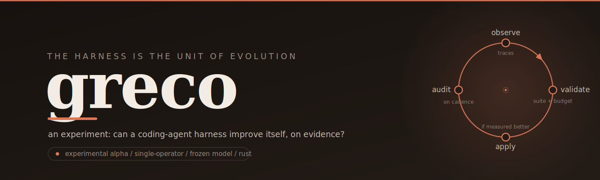

<p align="center">
  <picture>
    <source media="(prefers-color-scheme: dark)" srcset="assets/banner.svg">
    
  </picture>
</p>

<p align="center">
  <a href="https://github.com/Arakiss/greco/actions/workflows/ci.yml"></a>
  <a href="LICENSE"></a>
  <a href="rust-toolchain.toml"></a>
  <a href="docs/architecture/design.md"></a>
</p>

# Greco

> A Rust coding-agent harness that observes its own use and improves itself, within budgets and a suite the operator defines.

**Development status: recalibrated alpha.** The original alpha cycle (`0.1.0-alpha.1` through `0.3.0-alpha.1`) explored a skill-catalog evolutionary axis. After the loop closed, a critical review concluded the axis was self-referential and did not test the deeper aspiration of the project. The axis was replaced; the implementation now begins again at `0.4.0-alpha.1`. The skill code is preserved as historical scaffolding.

Greco's evolutionary unit is the *harness modification*: a typed, layered, reversible change to the control plane around a frozen model. Session traces reveal friction. The agent proposes modifications. Modifications are validated empirically against an operator-defined evaluation suite within strict budgets. Modifications that meet thresholds are applied autonomously. The operator does not approve per proposal; the operator designs the experiment and audits aggregate behavior on a cadence.

## Where It Fits

A serious coding-agent harness has several layers:

1. **Model provider**: OpenAI `gpt-5.4` through the Responses API.
2. **Primitive tools**: read, write, edit, bash.
3. **Subagent definitions**: declared, scoped, version-able.
4. **Active harness state**: system prompt, tool surface, settings, hooks, cached procedures.
5. **Evaluation suite**: operator-owned, read-only for the system.
6. **Modification loop**: friction detection, proposal, validation, application, archive, rollback.
7. **Audit surface**: aggregate reports for the operator on cadence.
8. **Operator surface**: CLI and plain-text TUI snapshots.

Greco owns layers 2-8. It does not try to be an IDE, a platform, a subagent runtime, or a hosted service.

## Why

Most "self-improving agent" talk collapses three different things: reasoning better inside one session, changing prompts/tools around a frozen model, and changing model weights. Greco targets the middle layer.

The bet:

- **The harness is the right unit.** Shared coding-agent products keep harness evolution conservative because their control plane affects many users. A *local, single-operator* harness can test autonomous iteration under strict budgets and audit.
- **Layered modifications.** Cached procedures and subagent prompt edits are cheap and low-risk; settings and permissions are expensive and high-risk. The system gates by layer, not by uniform rule.
- **Empirical admission against a real suite.** A modification is "an improvement" only if it reduces measurable friction on tasks the operator actually cares about. Proposal-level approval is replaced by suite-level evidence.
- **The human is not a notary.** The operator designs the suite, the budgets, and the thresholds. The operator audits aggregate behavior on cadence. Per-proposal approval is eliminated for the autonomous layers.
- **Persistent archive with lineage.** Every applied modification creates a checkpoint. Rollback is one command. Failed modifications stay archived because the archive is the memory substrate.

## Levels of Modification

| Layer | What changes | Risk | Gate |
|-------|---|---|---|
| **A** | Cached procedure | Low | Autonomous within budgets |
| **B** | Tool description or schema | Low | Autonomous within budgets |
| **C** | Composite tool from primitives | Medium | Autonomous, stricter thresholds |
| **D** | System prompt edit | Medium | Diff visible in audit, applies after cadence |
| **E** | Settings, hooks, permissions | High | Explicit per-modification operator approval |
| **S1** | Subagent prompt | Low-medium | Autonomous within budgets |
| **S2** | Subagent toolset | Medium | Autonomous, stricter thresholds |
| **S3** | New subagent definition | Medium | Autonomous, stricter thresholds |
| F | Primitive implementations | Very high | Out of scope v0 |
| G | Agent loop / harness code | DGM scale | Out of scope v0 |

## Current Surface

The alpha skill commands remain operational during the transition. Phase 1 (`0.4.0-alpha.1`) adds the first recalibrated instrumentation and baseline commands.

Alpha skill commands (historical):

```sh
greco --version
greco status --json
greco ask --input "Read README.md and summarize the project" --max-turns 6
greco tool read README.md
greco tool write scratch.txt "hello"
greco tool edit scratch.txt hello goodbye
greco tool bash "cargo test" --timeout 120
greco propose-skill --task "..."
greco catalog list --state all --json
greco catalog validate <id> --json
greco catalog promote <id> --json
greco catalog reject <id> --reason "..."
greco validate-skill examples/skills/pass --json
greco tui --snapshot
```

Recalibrated commands (Phase 1+):

```sh
greco eval list
greco eval run <task-id|all>
greco audit --since <window>
```

Planned commands:

```sh
greco eval probe <off-suite-task>
greco propose [--since <window>]
greco modification list --state <state>
greco modification show <id> [--diff]
greco modification validate <id>
greco modification apply <id>
greco modification revert <id>
greco harness checkpoint list
greco harness checkpoint restore <id>
```

`greco ask` continues to use OpenAI and requires `OPENAI_API_KEY`. Each run prints the local trace path on stderr. Local tool commands and validation do not require network access.

## Install From Source

```sh
cargo install --path . --force
```

The future crates.io package is `greco-cli` because `greco` is already occupied on crates.io. The installed binary remains `greco`.

## Local Configuration

```sh
cp .env.example .env.local
chmod 600 .env.local
```

`.env.local` is ignored by git. Greco also reads `~/.config/greco/env` for user-level local credentials.

```sh
OPENAI_API_KEY=...
GRECO_PROVIDER=openai
GRECO_MODEL=gpt-5.4
GRECO_HOME=.greco
```

Any API key copied through an untrusted channel must be rotated before public release.

## Modification Lifecycle

```text
session
  -> trajectory + friction instrumentation
  -> offline proposal pass over recent traces
  -> typed modification candidate (layer A/B/C/D/E or S1/S2/S3)
  -> validation against the suite within budgets
  -> apply autonomously | archive as rejected | escalate to next audit
  -> if applied: monitor over subsequent sessions
  -> aggregate audit report on cadence
  -> operator may rollback to any prior checkpoint
```

States in `.greco/catalog/`: `proposed/`, `validated/`, `active/`, `rejected/`, `retired/`. No artifact is ever deleted in v0. Every manifest carries layer, subject, diff, lineage, and target metric.

Example manifest:

```json
{
  "id": "tool_grep_extract",
  "version": "0.1.0",
  "layer": "C",
  "subject": "harness",
  "title": "Composite tool for find + grep + extract field",
  "rationale": "Pattern of 3+ bash invocations matching find/grep/cut chain.",
  "diff": {
    "kind": "add_tool_definition",
    "schema_path": "tools/grep_extract.json",
    "implementation_path": "tools/grep_extract.sh"
  },
  "lineage": {
    "parent_id": null,
    "source_traces": [".greco/traces/sessions/2026-05-27-...jsonl"],
    "proposal_trace": ".greco/traces/proposals/2026-05-27-...jsonl",
    "validation_trace": null
  },
  "metrics_target": {
    "primary": "turns_per_task",
    "expected_delta": -0.15
  }
}
```

## Friction Signals

Computed deterministically from traces, not from model judgment:

- `turns_per_task`
- `tokens_per_task`
- `repeated_errors`
- `retracements`
- `avoidable_prompts`
- `missing_tool_failures`
- `objective_success`

A modification must improve one or more without regressing any beyond a declared tolerance. The system retains a Pareto frontier when modifications trade off across metrics.

## Operator Cadence

Three frequencies:

- *During sessions*: regular agent use. Optional friction tagging.
- *On cadence (audit)*: review the audit report. Decide on Layer E proposals if any. Adjust suite or budgets if drift appears.
- *Rare configuration*: edit the suite, adjust budgets and thresholds, define a new subagent baseline.

No per-proposal approval at any phase from Phase 3 onward except for Layer E.

## Design Decisions

- **Responses API first.** Current OpenAI guidance recommends Responses for new agentic projects.
- **OpenAI only in v0.** Greco has a narrow provider trait, but one implementation.
- **Direct HTTP.** No `async-openai`, `rig`, `swiftide`, or `llm-chain` in v0.
- **Filesystem archive first.** SQLite can come later if scale demands.
- **Typed diffs only.** Free-form patches are not admissible as modifications at v0.
- **Plain TUI first.** Snapshot output is useful to humans and agents before widget frameworks are justified.

See:

- [`docs/architecture/design.md`](docs/architecture/design.md) — v0 design under the new axis
- [`docs/architecture/critical-analysis.md`](docs/architecture/critical-analysis.md) — answers to the RFC critical questions under the new axis
- [`docs/operations/roadmap.md`](docs/operations/roadmap.md) — versioned roadmap
- [`docs/operations/secret-handling.md`](docs/operations/secret-handling.md) — credential handling rules
- [`THREAT_MODEL.md`](THREAT_MODEL.md) — assets, boundaries, controls, new threats from self-modification

## Development

```sh
cargo fmt --all --check
cargo clippy --workspace --all-targets -- -D warnings
cargo test --workspace
cargo run -- status --json
```

Secret check:

```sh
git status --ignored --short
git grep -n -E "sk-(proj|svcacct)-" -- . ':!docs/**'
```

## Repository Map (transition state)

```text
src/
  agent.rs             Responses tool loop and trajectory handoff
  main.rs              CLI dispatch
  cli.rs               manual argument parser
  config.rs            env and local config loading
  provider/            model-provider trait and OpenAI adapter
  proposal.rs          alpha skill proposal (to be rewritten as friction-detection in Phase 2)
  tools.rs             primitive tool schemas and local execution
  trajectory.rs        JSONL session traces (to gain friction instrumentation in Phase 1)
  catalog.rs           alpha skill archive (to be rewritten as modification registry in Phase 2)
  validation.rs        alpha skill validation (to be rewritten as suite-based validation in Phase 2)
  tui.rs               plain-text operator snapshots
docs/
  architecture/        design, critical analysis
  operations/          roadmap, secret handling
examples/skills/       alpha skill fixtures (retained as historical reference)
```

New modules planned (Phase 1+): `eval`, `audit`, `subagent`, `harness`.

## Not In Scope

- subagent framework as a general platform;
- MCP;
- web UI;
- hosted marketplace;
- modification of primitive implementations (Layer F);
- modification of the agent loop or harness code itself (Layer G);
- prompt evolution outside the explicit Layer D mechanism with audit diff;
- context/playbook evolution as a separate axis;
- model fine-tuning.

## Honest Closure

The roadmap declares explicit decision gates at the end of Phase 1, Phase 2, and Phase 3. Each gate has a structural failure mode (noisy friction signals, junk proposals, no measurable aggregate improvement). Failing any gate triggers an honest closure with a final `What I learned` document. The point of the recalibration is not to extend the project at any cost. It is to give the project a thesis that can actually be tested.

## Status Summary

The alpha skill cycle is closed and documented. The recalibrated v0 begins at `0.4.0-alpha.1` with instrumentation and baseline (Phase 1). The tracked documentation set in `docs/` is the public product contract.
